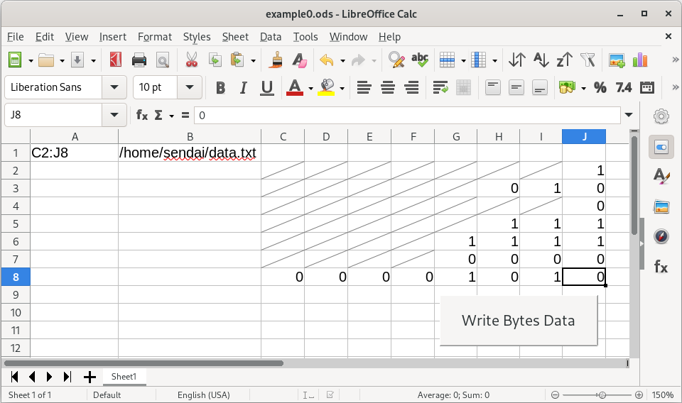

# LibreOffice Calcでビットをバイトに変換する



LibreOffice Calc上のビットデータからバイトにパックして
1行1バイトのファイルを作るpythonマクロを作ってみました。

- 例題LibreOffice Calcファイル [example0.ods](example0.ods)
- Pythonマクロプログラムファイル [write-bytes-data.py](write-bytes-data.py)

[pythonマクロを作る方法の解説](programming/)は別ページに書きました。

## 仕様

- A1セルでビットデータが入っているセル群を指定します。指定は左上セル名と右下セル名を
コロン(:)ではさんで指定します。
- A1セルで指定されたセルを順に読んで、bit 0あるいはbit 1をひろってバイトにつめていきます。
00000001と指定されていれば0x01になります。
- 0あるいは1にならないデータ(正確にはpythonでint(x)で数値にならないデータ)は無視します。
- example0.odsではビットデータを書くセルには0あるいは1しか入らないようにしてあります。
[programming/README.md](programming/README.md#セルに入れられる値を制限制約)をごらんください。
- 8ビットの整数倍にならない場合は警告が表示されファイルは書き出しません。

## 使いかた

1. LibreOffice Calcをセットします。AlmaLinux 9ならrootユーザーで
   ```
   dnf install libreoffice-calc
   ```
2. 一度LibreOffice Calcを起動します。コマンドは``libreoffice --calc``です。
3. マクロファイルの実行を許可するようにします。
   Tools -> Options -> LibreOffice -> Security -> [Macro Security ...] ボタン でSecurity LevelをMediumにセットしてください。
   次回からマクロを含んでいるファイルを開いたときにマクロを有効にするかどうかきいてきますので
   「有効にする」を選択してください。
4. [example0.ods](example0.ods)をダウンロードします。適当な場所に保存してください。curlを使うなら:
    ```
    curl -O https://github.com/h-sendai/LibreOfficeCalc-register/blob/main/example0.ods
    ```
5. ``$HOME/.config/libreoffice/4/user``ディレクトリができているのでその下に
   ``Scripts/python``ディレクトリを作ります。
   ``$HOME/.config/libreoffice/4/user/Scripts/python/``ディレクトリができます。
6. ``$HOME/.config/libreoffice/4/user/Scripts/python/``に
[write-bytes-data.py](write-bytes-data.py)
   をダウンロードします。
   ```
   cd $HOME/.config/libreoffice/4/user/Scripts/python
   curl -O https://github.com/h-sendai/LibreOfficeCalc-register/blob/main/write-bytes-data.py
   ```
7. Calcでexample0.odsを開きます。Calc起動後、メニューバーFileから選択するか
   ``libreoffice --calc example0.ods``とします。
8. A2セルに書かれているデータ保存ファイル名を自分の環境にあわせます。
9. [Write Bytes Data]ボタンを押すと各セルにかかれたビットデータがバイト列に
パックされて16進数で保存されます。

## その他コメント

- example0.odsでボタンの位置を移動させるには、
メニューバーTools →
Forms →
Design modeにチェックをいれると、移動できるようになります。移動後は
Design modeのチェックをはずしてください。
