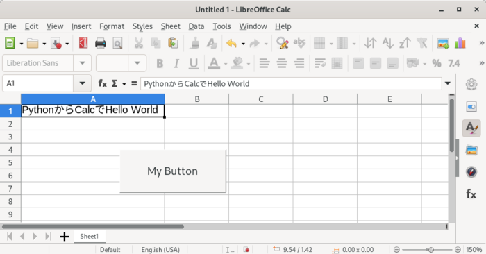

`# LibreOfficeCalc Register設定用プログラム



LibreOfficeCalcを使ってレジスタを設定するためのデータを
生成するプログラム。

AlmaLinux 8および9でテストしましたが、
以下の理由でAlmaLinux 9での利用を推奨します。

- AlmaLinux 8配布物にふくまれているLibreOffice Calcでは
  View -> Toolbars -> Form Controlで下向き三角とだどったあと
  Customize Toolbar...を選択するとLibreOffice Calcがクラッシュします。
- AlmaLinux 8配布物にふくまれているLIbreOffice Calcでは
  セットすると便利な外部モジュールAPSOの最新版をインストールすることが
  できない(APSOインストーラが``import importlib.metadata``しているが
  importlib.metadataモジュールはpython 3.8からpython標準ライブラリに
  追加されたものであり、AlmaLinux 8の/usr/bin/python3は3.6なので
  importlib.metadataのimportに失敗しインストールできない)
  (APSOの古いバージョンのものならインストール可能かもしれない)。

## Libreofficeマクロのドキュメント

- https://wiki.documentfoundation.org/Macros/Python_Guide/ja
- https://wiki.documentfoundation.org/Macros/Python_Guide/My_first_macro/ja
- https://tutolibro.tech/2019/03/18/libreoffice-calc-python-programming-part-0-get-started/

各種関数など

- https://openoffice3.web.fc2.com/Python_Macro_Calc.html
  https://openoffice3.web.fc2.com/Python_Macro_Calc_No2.html

## LibreOffice Calcインストール

### AlmaLinux 8, 9

```
# dnf install libreoffice-calc
```

### Ubuntu 2024.04 LTS

```
apt install libreoffice-calc libreoffice-script-provider-python
```

## LibreOffice Calcの起動

デスクトップ環境のメニューバーからLibreOffice Calcを起動することも可能だが、
pythonマクロ内からprint()関数でデバッグ風文字列を出力 しているので
ターミナルエミュレータからCalcを起動する。

```
% libreoffice --calc [filename]
```

``[filename]``は省略可能です。

起動後に
Tools -> Options -> LibreOffice -> Security -> [Macro Security ...] ボタン
でSecurity LevelをMediumにセットしてください。
次回からマクロを含んだファイルを開くとマクロを有効にするかどうかの
ダイアログがでるので有効にするを選んでください。

## Scriptの置き場所

Calcファイルに上で走らせるpythonプログラムの保存場所は

```
$HOME/.config/libreoffice/4/user/Scripts/python
```

です。Calcを起動すると``$HOME/.config/libreoffice/4/user/``ディレクトリは
自動で作成されますが、``Scripts/python``ディレクトリは自動では作成
されないようなので手動で作成しておきます。

```
cd $HOME/.config/libreoffice/4/user
mkdir -p Scripts/python
```

## Hello, world

Programming Language C (K & R)出版以来、最初に書くプログラムはHello worldです。
A1セルに文字列を挿入するマクロを動かしてみます。

### 手順


1. ``$HOME/.config/libreoffice/4/user/Scripts/python/``ディレクトリに
[hello.py](hello.py)にあるプログラムをコピーします。
```
wget https://github.com/h-sendai/LibreOfficeCalc-register/blob/main/hello.py
```


2. Calcを起動して
Tools →
Macros →
Run Macro →
Macro Selectorが起動する →
MyMacrosの▼ →
helloを選択→
Macro Name欄でhello_wordが選択されているのを確認
→ Runボタン
でA1セルに「PythonからCalcでHello world」と入ります。

### 追加説明

``$HOME/.config/libreoffice/4/user/Scripts/python/``ディレクトリにある
ファイルがMacro SelectorのLibraryのMy Macrosの下に表示されています。
ここにおくPythonスクリプトファイルには拡張子``.py``を付けておきます
(つけないとMacro Selectorで表示されません)。実行権限はつけてもつけなくても
よいです。Macro NameにはPythonスクリプト内の関数名が表示されています。
hello.pyにはhello_world()という関数しかなかったのでひとつしか
表示されていません。

hello.pyは
https://wiki.documentfoundation.org/Macros/Python_Guide/My_first_macro/ja
からもってきて、

- ファイル名、関数名を変更
- 下記ボタンからも起動できるように
``def hello_world()``に引数``*args``を追加したものです。このプログラムでは
``*args``は使わないですがないとボタンを押したときにエラーになります

## シート上にボタンを設置して、pythonプログラムをバインドする

pythonマクロを書いて動作を確認するのに上のようにメニューをたどるのは
大変だし、最終的にはボタンを押せばなにか動作するというふうにしたいので
まずボタンを追加してみます。

### ボタン追加、関数わりあて手順

1. メニューバー Insert -> Form Control -> Push Button
でボタンを追加できるようになりますのでシートの適当なところで
ドラッグしてボタンを追加してください。
Push buttonがグレイアウトされていて選択できない場合は
Tools -> Forms -> Design Mode でデザインモードに移行すると
ボタンを追加できるようになります。
2. ボタンを追加したら次はボタンを押したときに呼び出すプログラムを
指定します。
ここでは上で使った
hello.pyのhello_world()が走るようにしてみます。
ボタン上で右クリックしてControl Propertiesを選択します
（右クリックして何もおきない
場合はTools -> Forms -> Design Modeでデザインモードに移行して
ください）。
3. GeneralタブのLabelでボタン上に表示される文字列を指定します。
4. EventsタブのExecute actionの"..."をクリックしてpythonマクロを
割り当てます。Excute actionが反転表示されている状態で
右側[Macro...]を選択し、Libraryからhelloを選択すると
Macro Nameにhello_worldが入ります。
最初のhelloはファイル名で、Macro Nameは
そのファイル内にかかれている関数名一覧です。ここで指定した関数名の
関数がボタンを押すことで実行されます。
OKを2回おして、
Execute actionが``hello.py$hello_world(user,Python)``になっているのを確認します。
5. Properties: Push ButtonボックスのXを押します。
6. このままではまだボタンのまわりにちいさな正方形が配置されていることから
デザインモードになっていることがわかります。
メニューバーTools →
Design Mode (ここにチェックがはいっている)
でデザインモードを抜けます。
7. ボタンを押してA1セルに「PythonからCalcでHello World」という
文字列が入るのを確認する。

### 追加説明

入力された文字を消してもう一度ボタンを押して試すときには消したあと
エンターを押すか、カーソルを他のセルに移動されてからボタンを押してください。

メニューバー File→
Save as
で一度ファイルとして保存して、もう一度読み込ませてみると

> This document contains macros.
>
> Macros may contain viruses. Excution of macros is disabled due to
> the current macro security setting in Tools - Options - LibreOffice - Security.
>
> Therefore, some functionality may not be available.

とでるのでメニューバーから
Tools -> Options -> LibreOffice -> Security -> Macro Security
でMediumを選択しておきます。
これでもファイルを開いたときに

> The document contains document macros.
>
> Macros may contain viruses.  Disabling macros for a document is always safe.  If
> you disable macros you may lose functionality provided by the document macros
>
> [ Help ] [ Disable Macros ] [ Enable Macros ]

とでます。Enable Macrosを選択するとボタンが表示され押せるように
なります。
警告がまったく出ないようにするにはMediumではなくてLow (not recommended)を
選択すればよいと思いますので各自どれを選択するか決めて設定してください。

これであとは適宜
``$HOME/.config/libreoffice/4/user/Scripts/python/hello.py``
を編集して設置したボタンを押せば動作確認ができるようになりました。

## pythonプログラムをCalcファイルに同梱する

このままでもよいのですが、
LibreOffice Calcファイルに作ったpythonプログラムを同梱しておくと
便利な場合があります（人に渡す場合など）。

pythonプログラムを同梱する方法として、手動で作業する方法と
GUIを使う方法のふたとおりの方法があります。
ここではGUIを使う方法を解説します。

LibreOffice Calcに拡張機能APSO (Alternative Script Organizer for Python)
をインストールします。

1. https://extensions.libreoffice.org/en/extensions/show/apso-alternative-script-organizer-for-pythonのDownload latestボタンを押すとapso.oxtというファイル名でダウンロードされます。
2. Calcメニューバー Tools -> Extension Manager -> [Add] ボタン
3. apso.oxtファイルを指定

でインストールできます。
APSOで使用するエディタを指定する場合は
Calcメニューバー Tools -> Extension ManagerでAPSOを選択し、
[Options]ボタン、Editorの欄で指定できます。

インストールが終了するとメニューバーTools -> Macrosに
Organize Python Scripts が追加されます。

pythonスクリプトファイルをCalcファイルに埋め込むには
Tools -> Macros -> Organize Python Script
でダイアログを開きます。
``$HOME/.config/libreoffice/4/Scripts/python/``ディレクトリに
おいたファイルはMyMacroの下にありますのでファイルを選択して
メニューボタンからEmbed in documentを選ぶとCalcドキュメントに
埋め込まれます。

埋め込まれたPythonスクリプトファイルは
Tools -> Macros -> Organize Python Script
で一番下のファイル名(ファイルを保存していない場合はUntitled)の下にあります。

ボタンから``$HOME/.config/libreoffice/4/Scripts/python/``ディレクトリにある
スクリプトを走らせてるように設定した場合は、埋め込んだスクリプトファイル
を走らせるように変更しておきます。
変更方法は
Tools -> Forms -> Design Modeでデザインモードに移行して、
ボタン右クリックで
EventsタブのExecute actionの"..."をクリック、
出てくるダイアログでファイル名をクリックして出てくるファイルを
選択する、です。

(参考)
ボタンevents - execute actionの値

``$HOME/.config/libreoffice/4/user/Scripts/python/hello.py``中の
``hello_world()``を指定した場合は``hello.py$hello_world (user, Python)``
となっている。

Calcファイル埋め込みにした場合は
``hello.py$hello_world (document, Python)``となっている。
(参考終わり)

ファイルが埋め込まれたかどうかは端末から``unzip -l filename.ods``
するとわかります。埋め込まれていた場合にはNameの欄に
``Scripts/python/`` + ファイル名 があります。

埋め込んだスクリプトを編集するには
メニューバーTools -> Macros -> Organize Python Script
で出てくるダイアログでCalcファイル名の左側▼をクリックし、
出てきたスクリプトファイル名を選択、メニューボタンからeditを
選択するとエディタが起動します。
保存後、シート上に設置したボタンを押す、あるいは
Tools -> Macros -> Run Macroでスクリプトを走らせても編集後の
動作はしません（どこかで編集前のものがキャッシュされているらしい）。
Calcファイルを保存し、Calcを再起動させると修正後の動作が確認できます。

最終的にスクリプトに埋め込むことにするにしてもスクリプトを
開発するには

- ``$HOME/.config/libreoffice/4/user/Scripts/python/``にファイルをおく
- スクリプトを走らせるためにメニューをたどるのは面倒くさいのでボタンを設置しておく

というのが良いと思います。

すでにスクリプトを埋め込んだCalcファイルでも再び
``$HOME/.config/libreoffice/4/user/Scripts/python/``
にあるファイルを埋め込もうとすると、「同名ファイルがあるが上書きするか」
と聞いてきます。

## エラーの報告

```
raise ValueError('bit length is not multiple of 8: bit length: %d' % (len(bits)))
```

のように例外を出すとエラーダイアログが出現します。他に画面一番下に
メッセージを出すなどの方法もありますが、気づかない場合もありますので
こちらの方法がよいと思います。

## セル set/get

- [set-cell.py](set-cell.py)
- [get-cell.py](get-cell.py)
